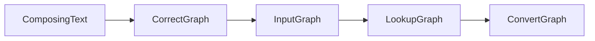
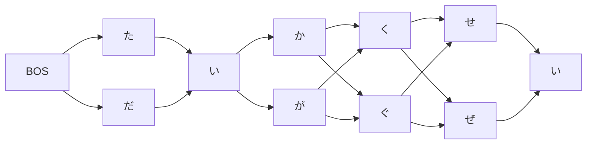
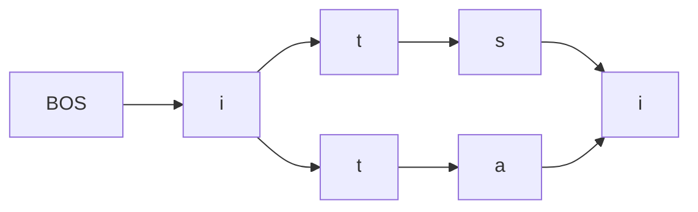
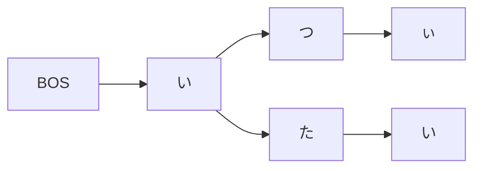

#  グラフによる変換

`InputGraph`では、ユーザ入力をグラフとして管理する方式による変換を実装している。

## 背景

従来、azooKeyではユーザ入力を`ComposingText`で管理し、内部的には`[InputElement]`という操作列でユーザ入力を表し、これを変換アルゴリズムでも利用していた。

### ローマ字入力の問題

ローマ字入力では「ka→か」のような置換が発生するため、ユーザ操作列を変換アルゴリズム側で利用することは本来的に不可能である。このため、従来実装では「ka→か」の置換を行った仮名文字列を生成後、その仮名文字列が`[InputElement]`のどのrangeに対応するかを記録していた。

様々なアドホックな制約を加えることで、この方法はおおよそうまく行くが「tt→っt」のようなケースは対応困難である。なぜなら「っt」という単位はその後さらに「ta→た」などの方法で再度置換されるため、対応rangeという考え方が噛み合わない。

そこで従来実装ではこのケースを諦め、`[InputElement]`の時点で「tt」を「っt」と置換し、操作列そのものを歪めることで多段階置換を防ぐことにした。これはおおよそ妥当な実装だが、これにより「attack」のようなローマ字列を入力した際の英単語変換が動作しなくなった。

また、ローマ字入力ロジックに強く結びついた実装であるため、カスタムローマ字かな変換のサポートなども困難になっていた。

### 誤字訂正の問題

また、azooKeyは誤字訂正のサポートを持っているが、これにも問題があった。前述の通り、従来実装では`[InputElement]`の範囲に対して仮名文字列を生成し、それを用いて変換する方式をとっている。

誤字訂正はこの仮名文字列生成時に同時に実施している。具体的には、例えば「か」という仮名が出てきたら「が」を追加する。これはグラフベースの手法によって逐次的に構成するが、最終的には訂正候補の文字列がいくつも列挙される。例えば「たいかくせい」と入力した場合、`た`, `か`, `く`, `せ`の4箇所で濁点がつきうるので、2⁴=16候補が仮名文字列として生成される。

組合せ爆発を防ぐため、実際には3箇所のみを置換しうると制約しているものの、「は→ば・ぱ」のように2つの候補が存在する候補もある。範囲は最大20文字であるため、$_{20}{\textrm C}_{3} \times 27 = 30780$通りの文字列が最悪ケースで生成される（本当か？）。3万通りの候補の列挙自体も去ることながら、これだけの数の文字列が生成されるとパフォーマンスへの悪影響が非常に大きい。

## 新実装

これら2つの問題を同時に解決する手法として、グラフベースの入力管理システムを構築する。

基本的なアイデアは、操作列に対する誤字訂正とローマ字かな変換をグラフ上で実施することである。新実装では次のような多段階のグラフ変換を通して変換を実施する。

`CorrectGraph`は誤字訂正を実施するグラフである。例えば、`ComposingText`が「たいかくせい」の場合、次のようになる。

ローマ字入力で「itsi」の場合、次のようになる。ただし「ts→ta」の訂正ルールが存在するとする。

`InputGraph`は`CorrectGraph`に対して置換ルールを適用する。この置換ルールはローマ字かな変換ルールを一般化したものである。この一般化した置換ルールを扱うことによって、カスタム置換ルールへの道が開ける。

上記の「itsi」の例に対しては、次のようなグラフが構築される。フリック入力の「たいかくせい」の場合は置換ルールが存在しないため同型である。

この時点で、ローマ字かな変換は実施しているが、誤字訂正後の文字列全体を生成することは行なっていない。従来実装では辞書引きのためにこれを文字列に戻す必要があったが、新実装ではこのまま`LookupGraph`に移る。

`LookupGraph`はこのグラフ構造を保ったまま辞書引きを実施する。AzooKeyKanaKanjiConverterが辞書データの構造に利用しているトライ（prefix tree）は接頭辞検索が定数時間で行える。そこで、それぞれのノードから次ノードに遷移しつつ辞書引きを進めることにより、グラフ構造から明示的に文字列を生成する必要がなくなる。さらに、「だいがぐ」のような接頭辞検索で一件もヒットしない文字列を生成した場合、その時点で辞書引きが停止するため、不要な検索を減らすことができる。

最後に、`ConvertGraph`を`LookupGraph`に対して構築し、この上でViterbiサーチを実行することで変換を進める。このアルゴリズムは通常のViterbiサーチに対して直感的な拡張として実装できる。
